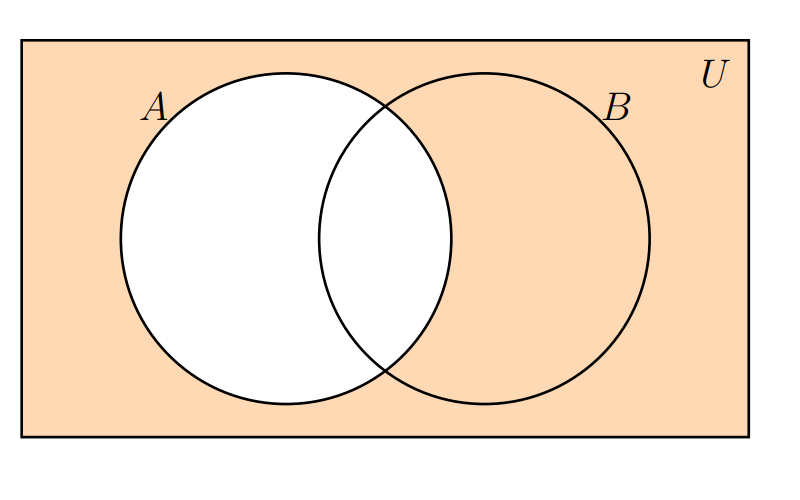
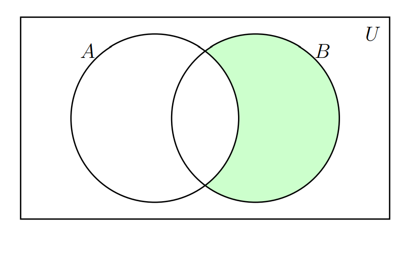

```{r setup, include=FALSE}
knitr::opts_chunk$set(echo = TRUE,comment = NA)

# colores
c0= "#b0394a"
c1= "#ad6395"
c2= "#a391c4"
c3= "#8acfe6"
c4= "#646420"
c5= "#db524f"

```

<br/><br/>

## **Introducción** 

A continuación se relacionan las principales características de los conjuntos y sus principales relaciones. Estos conceptos serán importante en el momento de abordar los conceptos básicos de  probabilidad que serán expuestos en el Modulo 2. 

En pesaremos con su definición

<div style="padding: 15px; border: 1px solid transparent; border-color: transparent; margin-bottom: 20px; border-radius: 4px; color: #000000; background-color: #FFE5E5 ; border-color: #000000;">

## **Conjunto**

Un conjunto es una colección de objetos que se denota con una letra mayúscula (comúnmente las primeras letras del alfabeto A,B,C..) . 

</div>


Se pueden escribir por:

+ **por extensión** :  $A=\{0,1,2,3,4,5,6,7,8,9\}$, escribiendo todos los elementos que lo conforman.
 
+ **por su nombre** : los dígitos

+ **por compresión** : $A=\{ x\in\mathbb{Z},  0\le x  \le 9    \}$, utilizando  nomenclatura matemática.

Al  comparar o combinar conjuntos debemos hacer uso de sus propiedades y operaciones, dentro de  las  cuales se encuentran $A \cup B$, $A \cap B$, 

## **Unión del conjunto**

Unión del $A$ con el conjunto $B$.\hspace{.4cm} $A \cup B$, $\overline{A}$ ,$A - B$, entre  otras. La zona sombreada en la siguiente figura representa estas operación

{width=50%}

|    |                                     |
|:--:|:------------------------------------|
| |Supongamos los siguientes conjuntos : $A = \{a,e,i,o,u \}$ y $B = \{1,2,3,4,5,6,7,8,9,0\}$ |
 
 $A \cup B = \{a,e,i,o,u, 1,2,3,4,5,6,7,8,9,0 \}$ 
 
 <br/><br/>
 
## **Intersección** 

La intersección entre el conjunto $A$ y el $B$ se denota por : $A \cap B$ y se representa por la siguiente zona sombreada

{width=50%}


|    |                                     |
|:--:|:------------------------------------|
|  |Supongamos los siguientes conjuntos : $A = \{1,2,3,4,5,6 \}$ y $B = \{2,4,6,8,10,12,14,16,18,20 \}$  |


$A \cap B = \{ 2,4,6 \}$ 

<br/><br/>

## **Complemento**

El complemento del conjunto $A$ se escribe como: $\overline{A}$ y se representa por la siguiente zona sombreada

{width=50%}

<br/><br/>

## **Resta**
 
La resta del conjunto $B$ menos el conjunto $A$ : $B-A$ , está representada por la zona sombreada en la siguiente figura
 
 {width=50%}

|    |                                     |
|:--:|:------------------------------------|
| |Supongamos los siguientes conjuntos : $A = \{1,2,3,4,5,6 \}$ y $B = \{2,4,6,8,10,12,14,16,18,20 \}$ |

$B-A =\{ 8,10,12,14,16,18,20 \}$

<br/><br/>
